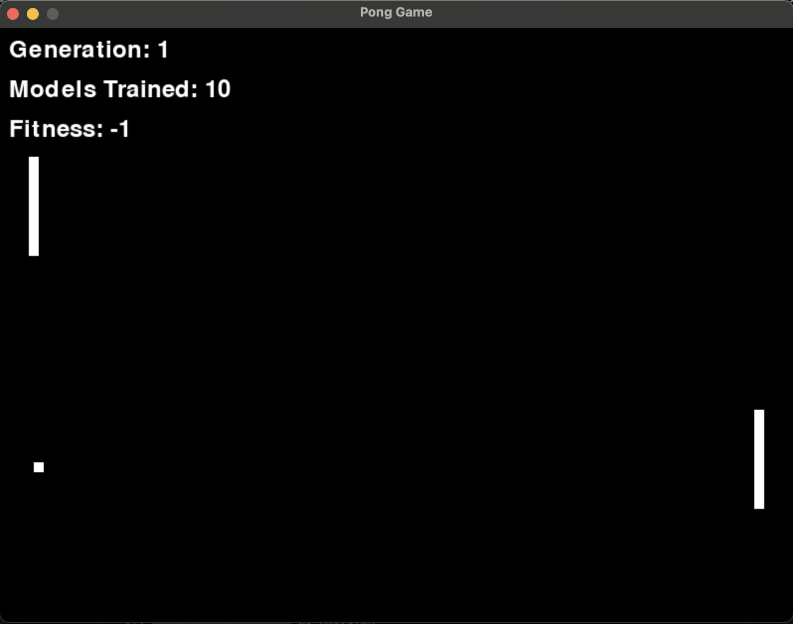

# Pong Game with Evolving AI

A Pygame-based Pong implementation where AI agents learn to play using a **genetic algorithm**, with neural networks acting as control policies.

This project explores evolutionary learning, fitness evaluation, and model iteration in a simple but expressive game environment. It is an experiment in learning systems, not a polished commercial game.

---

## Overview

- Classic Pong built with **Pygame**
- AI-controlled paddles driven by **neural networks**
- Training via a **genetic algorithm** (selection, crossover, mutation)
- Saved training artifacts:
  - Neural network models (`.h5`)
  - Training datasets (`.npy`)
- Supports running trained agents or continuing evolution

---

## How the AI learns

Each AI paddle is controlled by a small neural network that maps game state → action.

Typical inputs include:
- Ball position
- Ball velocity (direction)
- Paddle position

Training loop:
1. Initialize a population of agents with randomized weights
2. Run simulated games
3. Assign fitness based on performance (e.g. survival time, successful returns)
4. Select top-performing agents
5. Apply crossover and mutation
6. Repeat over generations

Over time, agents learn to track the ball and return it more consistently.

---

## Project structure

.
├── GA_AI.py # Genetic algorithm logic (selection, mutation, evolution)

├── Network.py # Neural network definition and inference

├── main.py / pong.py # Game loop and simulation logic

├── *.h5 # Saved neural network models

├── pong_data.npy # Training inputs

├── pong_labels.npy # Training labels / outcomes

├── requirements.txt # Dependencies (if present)

└── README.md

(Filenames may vary slightly depending on experiment state.)

---

## Setup

### Requirements
- Python 3.8+
- Pygame
- NumPy
- TensorFlow / Keras

Install dependencies:
pip install pygame numpy tensorflow
Running the project
Run the game:
python main.py
Run the genetic algorithm training loop (if separate):
python GA_AI.py

